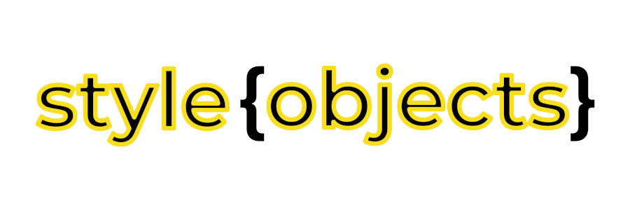

CSS properties as JS objects. Jstyes makes easier style your view as javascript objects instead plain css. Made up thinking in React Native / React JS projects, but can be used in other contexts.

## Table of Contents
- [Support](https://github.com/enriquerene/style-objects#support)
- [Installation](https://github.com/enriquerene/style-objects#installation)
- [Usage](https://github.com/enriquerene/style-objects#usage)
- [Contribute](https://github.com/enriquerene/style-objects#contribute)

## <a name="support"></a> Support
If you need some help you can open an issue or get in touch by email ([contato@enriquerene.com.br](mailto:contato@enriquerene.com.br)).


## <a name="installation"></a> Installation
There are some installation ways. You can choose the best way for you.

### NPM
This way requires [NodeJS](https://nodejs.org). With NodeJS installad use `yarn` or `npm`:
```bash
$ yarn add style-objects
```
or
```bash
$ npm install style-objects
```

### Git
Clone the repo into your project:
```bash
$ git clone https://github.com/enriquerene/style-objects.git
```

### Zip
Dowload the package and uncpack it into your project:
(Dowload ZIP)[https://github.com/enriquerene/style-objects/archive/main.zip]

## <a name="usage"></a> Usage
You can import all style objects from package:
```javascript
import React from "react";
import styleObjects from "style-package";
const borderStyle = styleObjects.border.border // change this
const styledElement = 
<div style={}></div>
```
or
```bash
$ npm install style-objects
```


## <a name="contribute"></a> Contribute
